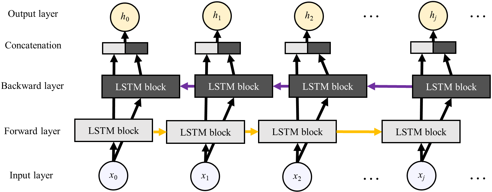
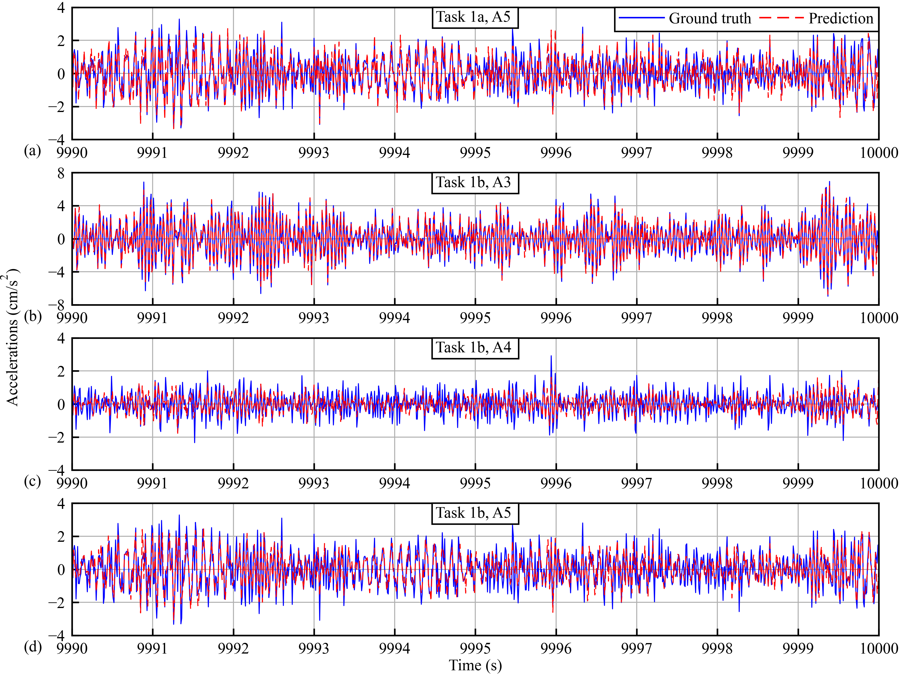
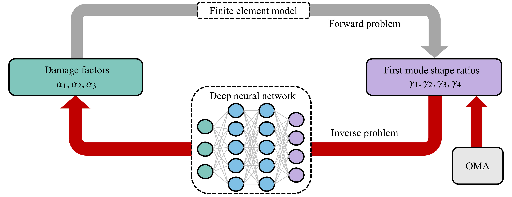

# IC-SHM2022-project3

The repository contains the code and documentation for our team's entry in the 3rd International Competition for Structural Health Monitoring(IC-SHM 2022) project 3. Our solution is designed to solve the following 2 tasks:

- Task 1: data-driven modeling
- Task 2: damage identification

In the root directory, the following three .txt files are the required results for two tasks.
- Task 1a: **project3_a_task_code.txt**
- Task 1b: **project3_b_task_code.txt**
- Task 2: **project3_damage_task.txt**
- 
## Getting Started

To get started with our solution, you can follow these steps:

- Clone this repository to your local machine
- Check if the installed version of the packages meets the requirements
- PyCharm or VScode is recommended to run codes
- For task 1a, set the folder **project3_a_task_code** as workspace, run [project3_a_task_code.py](<./project3_a_task_code/project3_a_task_code.py>) to reproduce **project3_a_task_code.txt**.
- For task 1b, set the folder **project3_b_task_code** as workspace, run [project3_b_task_code.py](<./project3_b_task_code/project3_b_task_code.py>) to reproduce **project3_b_task_code.txt**.
- For task 2, set the folder **project3_damage_task_code** as workspace, run [project3_damage_task_code.py](<./project3_damage_task_code/project3_damage_task_code.py>) to reproduce **project3_damage_task.txt**.

### Requirements

- Python >= 3.8.0
- Pytorch >= 1.12.1
- SciPy >= 1.9.3
- scikit-optimize >= 0.9.0

## Task 1: Data-driven Modeling

In this task, we aim to reconstruct the lost data without the noises of one accelerometer A5 in the data noised testset.mat (100 s), and three accelerometers A3-A5 in data noised testset2.mat (100 s), respectively, through the bidirectional Long-Short Term Memory (BiLSTM) network. Only the data of the first 10 s in data clean.mat is used for training and data of the rest 9,990 s are used for validation. It is demonstrated that the mean square error (MSE) of the reconstructed data is at a very low magnitude of $1\times10^{-5}$.

### Methodology

BiLSTM network is a kind of recurrent neural network (RNN) that allow previous outputs to be used as a part of current input, therefore it is suitable for time-series modeling. The architecture of the BiLSTM network is shown below, where LSTM blocks receive $x_0, x_1, \dots,x_j$ in sequence from the input layer and generate $h_0, h_1, \dots,h_j$ to the output layer. The recurrent connection between adjacent LSTM blocks enables the past information to be memorized and reused in the data processing. In BiLSTM, the information is transmitted both forward and backward. The hidden states computed from two information flows are concatenated to generate the output sequence. Therefore, BiLSTM is powerful in forming the evolution of the hidden states during the time-series processing, based on both past and future.

	

### Results

The effectiveness of the model is validated by using data noised.mat. The MSEs of task 1a and task 1b are shown in the following table (unit: $1\times 10^{-5} \text{m}^2/\text{s}^{4}$). The ground truth and prediction results are shown in the following figure: (a) A5 in task 1a, and (b) A3, (c) A4, and (d) A5 in task 1b.

| Task 1a   (A5) | Task 1b  (A3) | Task 1b  (A4) | Task 1b  (A5) |
| :----------------: | :---------------: | :---------------: | :---------------: |
|       2.8765       |      2.6005       |      3.0368       |      4.7185       |

	

### Folder Structure

1. **project3_a_task_code**:
   - [**project3_a_task_code.py**](<./project3_a_task_code/project3_a_task_code.py>): code to load trained model to reproduce the result for task 1a, and run it will generate **project3_a_task_code.txt** in workspace. 
   - [**main.py**](<./project3_a_task_code/main.py>): code to train and validate the model in task 1a.
   - [**tool.py**](<./project3_a_task_code/tool.py>): functions for loading task 1a data, establishing neural networks, and training, validating, and testing the model.
   - [**a**](<./project3_a_task_code/a>): training and test dataset of task 1a provided by IC-SHM 2022 Committee.
   - [**model_checkpoint**](<./project3_a_task_code/model_checkpoint>): saved trained models of task 1a.

2. **project3_b_task_code**:
   - [**project3_b_task_code.py**](<./project3_b_task_code/project3_b_task_code.py>): code to load trained model to reproduce the result for task 1b, and run it will generate **project3_b_task_code.txt** in workspace. 
   - [**main.py**](<./project3_b_task_code/main.py>): code to train and validate the model in task 1b.
   - [**tool.py**](<./project3_b_task_code/tool.py>): functions for loading task 1b data, establishing neural networks, and training, validating, and testing the model.
   - [**b**](<./project3_b_task_code/b>): training and test dataset of task 1b provided in IC-SHM 2022 Committee.
   - [**model_checkpoint**](<./project3_b_task_code/model_checkpoint>): saved trained models of task 1b.

## Task 2: Damage Identification

In this task, we aim to implement damage identification of three specified units (7, 22, 38) in a three-span continuous bridge (other units stay undamaged) through the use of random vibration data from five channels. There are six cases in the testing datasets, and the developed algorithm results in a $6\times3$ matrix. It is remarked that **the training
dataset provided by the IC-SHM 2022 Committee for this task is completely unused**.

### Methodology

The proposed method demonstrates that the mode shapes of a three-span continuous beam are independent of finite element model parameters and are only affected by the reduction rates of the elastic modulus (i.e., the damage factors). Moreover, we are able to construct a closed-form forward mapping that relates the damage factors to the mode shapes. By using this mapping, we generate a large number of label pairs whose feature and target domain are exchanged, which allows us to train a deep neural network with mode shape ratios as input and damage factors as output. We use Bayesian optimization to automatically tune the hyper-parameters of the network for more accurate predictions. In this competition, we are provided with random vibration signals from A1 to A5. The frequency domain decomposition method is adopted to extract the mode shape of the beam, which is then fed into the neural network to compute the damage factors. An overview of the proposed method is shown as follows.

	

### Results

Given the test dataset, our deep neural network could accurately predict the elastic modulus reduction rates. The results that retain 6 decimal places are shown in the following table.

| File name | Damage condition   (Unit No.7) | Damage condition  (Unit No.22) | Damage condition  (Unit No.38) |
| :-------: | :--------------------------------: | :--------------------------------: | :--------------------------------: |
|  test_1   |              0.002931              |              0.097144              |              0.005024              |
|  test_2   |              0.000000              |              0.499517              |              0.004262              |
|  test_3   |              0.221431              |              0.000000              |              0.003660              |
|  test_4   |              0.413827              |              0.000000              |              0.018817              |
|  test_5   |              0.192929              |              0.200971              |              0.189067              |
|  test_6   |              0.397418              |              0.400919              |              0.403472              |

### Folder Structure
**project3_damage_task_code**:
   - [**project3_damage_task_code.py**](<./project3_damage_task_code/project3_damage_task_code.py>): code to load trained model to reproduce the result for task 2, and run it will generate **project3_damage_task.txt** in workspace.
   - [**fembeam.py**](<./project3_damage_task_code/fembeam.py>): a class that constructs the finite element model for the three-span continuous bridge.
   - [**neuralnets.py**](<./project3_damage_task_code/neuralnets.py>): several classes including training data set generation, neural network definition and training, as well as the Bayesian optimization for hyper-parameters tuning.
   - [**oma.py**](<./project3_damage_task_code/oma.py>): a class for operational modal analysis using frequency domain decomposition.
   - [**figs_and_tables.py**](<./project3_damage_task_code/figs_and_tables.py>): numerous methods to implement the figures and tables utilized in the report.
   - [**data**](<./project3_damage_task_code/data>): training and test dataset provided in IC-SHM 2022 Committee, training histories for neural networks and Bayesian optimization.
   - [**figs**](<./project3_damage_task_code/figs>): figures for random vibration, normalized root mean square error matrix, Bayesian optimization and neural network convergence plots.
   <!--
   Python source codes, data, and figures to demonstrate and reproduce the results. The data and figures are organized in individual folders, and the source codes are presented directly in this folder. -->

## License

This project is licensed under the MIT License - see the [LICENCE](./LICENCE) file for details.

## Acknowledgments

The work described in this report was supported by a grant from the Research Grants Council (RGC) of the Hong
Kong Special Administrative Region (SAR), China (Grant No. PolyU 152308/22E). The authors also appreciate the
funding support by the Innovation and Technology Commission of Hong Kong SAR Government to the Hong Kong
Branch of National Engineering Research Center on Rail Transit Electrification and Automation (Grant No. K-BBY1) and The Hong Kong Polytechnic University’s Postdoc Matching Fund Scheme (Grant No. 1-W24B).
